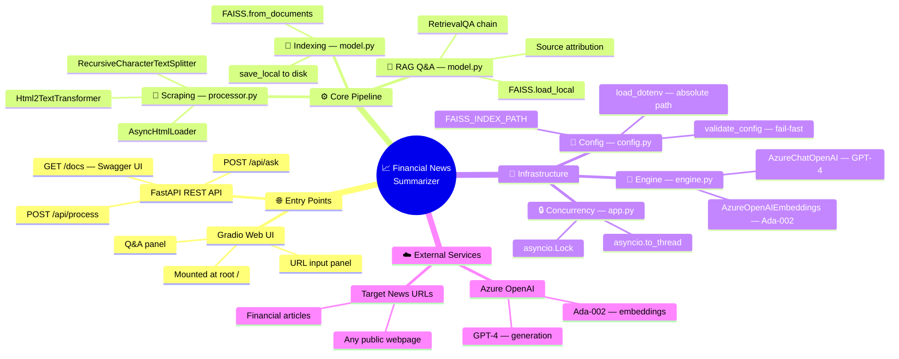
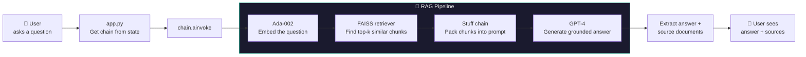
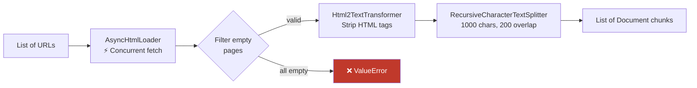
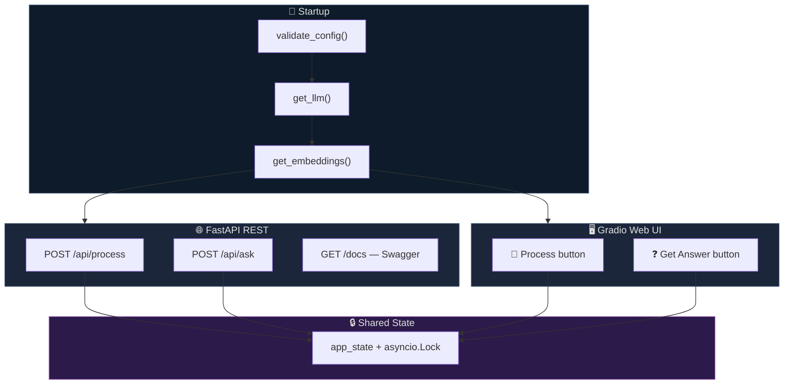
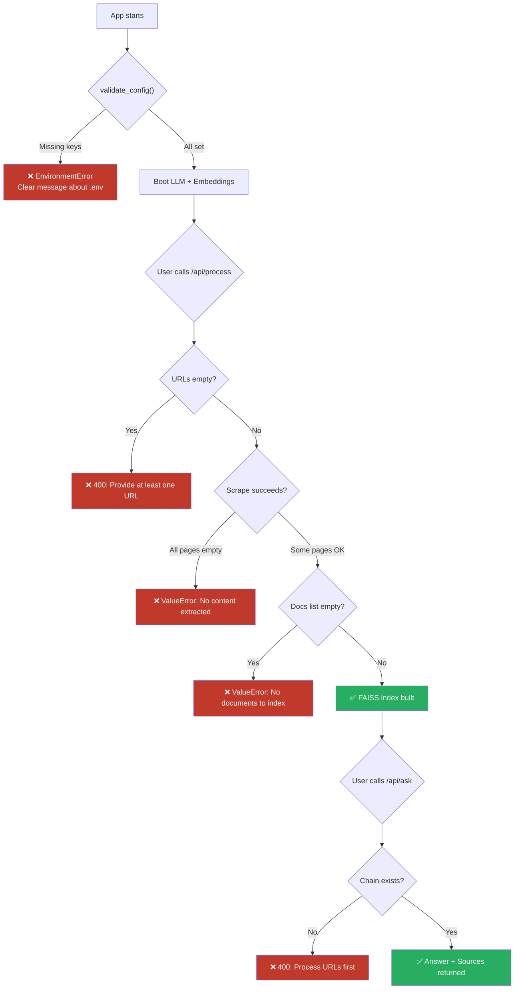

# 🏗️ Architecture — Financial News Summarizer

> A Retrieval-Augmented Generation (RAG) system that ingests live financial news
> from URLs, builds a searchable knowledge base, and answers user questions
> grounded in the actual article text.

---

## 🧠 Project Mind Map



---

## 🔄 Request Flow — End to End

The system has **two phases**: **Ingestion** (processing URLs) and **Retrieval** (answering questions).

### Phase 1 — Ingestion (`POST /api/process` or Gradio 🔗 Process)

```mermaid
flowchart LR
    A["👤 User<br/>submits URLs"] --> B["app.py<br/>Validate input"]
    B --> C["processor.py<br/>scrape_and_process_urls"]
    
    subgraph SCRAPE ["🔗 Scraping Pipeline"]
        direction TB
        C1["AsyncHtmlLoader<br/>Fetch HTML concurrently"] --> C2["Filter empty pages"]
        C2 --> C3["Html2TextTransformer<br/>HTML → plain text"]
        C3 --> C4["RecursiveCharacterTextSplitter<br/>Split into 1000-char chunks"]
    end
    
    C --> C1
    C4 --> D["model.py<br/>create_vector_store"]
    
    subgraph INDEX ["🧮 Indexing"]
        direction TB
        D1["Ada-002 embeddings<br/>Text → 1536-dim vectors"] --> D2["FAISS.from_documents<br/>Build similarity index"]
        D2 --> D3["save_local<br/>Persist to disk"]
    end
    
    D --> D1
    D3 --> E["model.py<br/>get_rag_chain"]
    E --> F["✅ Chain ready<br/>Stored in app_state"]

    style SCRAPE fill:#1a1a2e,stroke:#e94560,color:#eee
    style INDEX fill:#1a1a2e,stroke:#0f3460,color:#eee
```



### Phase 2 — Retrieval (`POST /api/ask` or Gradio ❓ Get Answer)



---

## 📁 Module Breakdown

### File Structure

```
News_summ_RAG_and_fewshot/
│
├── app.py                  ← 🚀 Entry point, API + UI
├── requirements.txt        ← 📦 Dependencies
├── OpenAI_APIkey.env       ← 🔑 Azure credentials (user-created)
├── README.md               ← 📖 Documentation
├── architecture.md         ← 🏗️ This file
│
├── src/
│   ├── __init__.py         ← Package marker
│   ├── config.py           ← ⚙️ Env loading & validation
│   ├── engine.py           ← 🧪 LLM & embedding factory
│   ├── processor.py        ← 🔗 Web scraping pipeline
│   └── model.py            ← 🧮 Vector store & RAG chain
│
└── faiss_index/            ← 💾 Generated at runtime (not committed)
```

---

### 1 · `config.py` — ⚙️ Configuration & Validation

| Aspect | Detail |
|---|---|
| **What it does** | Loads Azure credentials from `OpenAI_APIkey.env`, exposes them via `Config` class, provides `validate_config()` for fail-fast startup |
| **Why necessary** | Centralizes all secrets and paths. Uses `Path(__file__)` to resolve the `.env` path relative to the project root — works regardless of where `python app.py` is run from |
| **Key exports** | `Config.AZURE_OPENAI_ENDPOINT`, `Config.AZURE_OPENAI_API_KEY`, `Config.OPENAI_API_VERSION`, `Config.FAISS_INDEX_PATH`, `validate_config()` |

```
OpenAI_APIkey.env ──load_dotenv──► Config class ──validate_config──► ✅ or ❌ EnvironmentError
```

---

### 2 · `engine.py` — 🧪 LLM & Embedding Factory

| Aspect | Detail |
|---|---|
| **What it does** | Creates and returns pre-configured Azure OpenAI clients: one for text generation (GPT-4), one for embeddings (Ada-002) |
| **Why necessary** | Decouples client creation from business logic. Credentials are explicitly wired from `Config` — no hidden env-var side effects |
| **Key exports** | `get_llm()` → `AzureChatOpenAI`, `get_embeddings()` → `AzureOpenAIEmbeddings` |

```
Config credentials ──► get_llm()        ──► AzureChatOpenAI  (GPT-4, temp=0.7)
                   ──► get_embeddings() ──► AzureOpenAIEmbeddings (Ada-002, batch=16)
```

---

### 3 · `processor.py` — 🔗 Web Scraping Pipeline

| Aspect | Detail |
|---|---|
| **What it does** | Takes a list of URLs → fetches HTML concurrently → converts to plain text → splits into overlapping chunks |
| **Why necessary** | Raw HTML is noisy (scripts, CSS, nav bars). This module extracts only readable content and chunks it to fit the embedding model's context window |
| **Key export** | `scrape_and_process_urls(urls)` → `list[Document]` |



> [!TIP]
> **Why 200-char overlap?** It ensures sentences at chunk boundaries aren't cut in half —
> the retriever can find context that spans two chunks.

---

### 4 · `model.py` — 🧮 Vector Store & RAG Chain

| Aspect | Detail |
|---|---|
| **What it does** | `create_vector_store()` embeds document chunks and saves the FAISS index to disk. `get_rag_chain()` loads the index back and wraps it in a LangChain `RetrievalQA` chain |
| **Why necessary** | FAISS gives O(1) similarity search over thousands of chunks. Persisting to disk means the index survives server restarts. The RetrievalQA chain orchestrates the retrieve → stuff → generate flow |
| **Key exports** | `create_vector_store(docs, embeddings)`, `get_rag_chain(llm, embeddings)` |

```
             ┌──────────────────────────────────────┐
             │         create_vector_store           │
             │                                      │
  docs ─────►│  Ada-002 embed ──► FAISS index       │──► save to disk
             │                                      │
             └──────────────────────────────────────┘

             ┌──────────────────────────────────────┐
             │           get_rag_chain               │
             │                                      │
  disk ─────►│  Load FAISS ──► as_retriever()       │──► RetrievalQA chain
             │                  ──► stuff prompt     │
             │                  ──► GPT-4 generate   │
             └──────────────────────────────────────┘
```

---

### 5 · `app.py` — 🚀 Entry Point (FastAPI + Gradio)

| Aspect | Detail |
|---|---|
| **What it does** | Boots the application: validates config → creates LLM/embeddings → defines REST API endpoints → defines Gradio UI → mounts everything on uvicorn |
| **Why necessary** | Single entry point that exposes **two interfaces** for the same pipeline: a programmatic REST API (for integrations) and a visual Gradio UI (for humans) |
| **Concurrency safety** | Uses `asyncio.Lock` to prevent race conditions when multiple users process URLs simultaneously. Uses `asyncio.to_thread` for sync FAISS operations so the event loop stays free |



---

## 🔌 API Reference

| Endpoint | Method | Request Body | Response | Purpose |
|---|---|---|---|---|
| `/api/process` | `POST` | `{ "urls": ["..."] }` | `{ "message": "..." }` | Scrape URLs and build FAISS index |
| `/api/ask` | `POST` | `{ "query": "..." }` | `{ "answer": "...", "sources": [...] }` | Ask a question against indexed docs |
| `/docs` | `GET` | — | Swagger UI | Interactive API documentation |
| `/` | `GET` | — | Gradio UI | Visual web interface |

---

## 🛡️ Safety & Error Handling



---

## 📦 Tech Stack

| Layer | Technology | Role |
|---|---|---|
| **Web Server** | Uvicorn | ASGI server running the async event loop |
| **API Framework** | FastAPI | REST endpoints with auto-generated Swagger docs |
| **Web UI** | Gradio | Interactive browser UI, mounted on FastAPI |
| **Orchestration** | LangChain | Chains, loaders, splitters, retrievers |
| **LLM** | Azure OpenAI GPT-4 | Generates answers from retrieved context |
| **Embeddings** | Azure OpenAI Ada-002 | Converts text to 1536-dimensional vectors |
| **Vector Store** | FAISS (CPU) | Fast approximate nearest-neighbor search |
| **Scraping** | aiohttp + Html2Text | Concurrent HTML fetch and clean-up |
| **Config** | python-dotenv | Loads `.env` file into `os.environ` |
| **Validation** | Pydantic | Request/response schema enforcement |
